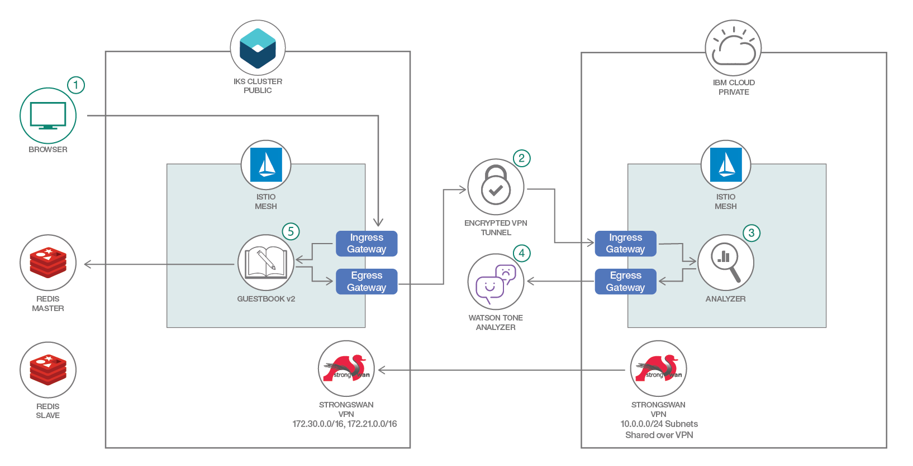
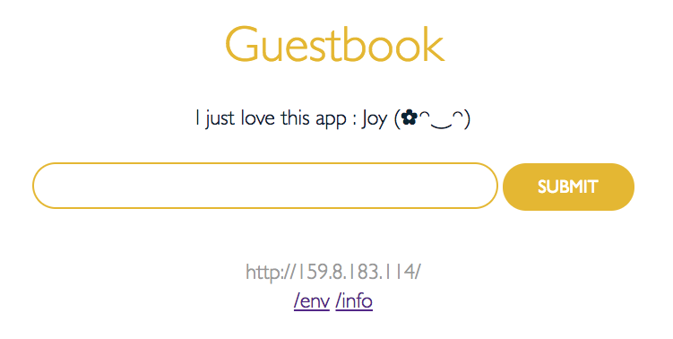

# Using Istio Across Private and Public Clusters

In this Code Pattern, we will create a hybrid cloud by connecting services
between [IBM Cloud Private](https://www.ibm.com/cloud/private) (ICP) and
[IBM Cloud Kubernetes Service](https://www.ibm.com/cloud/container-service)
(IKS) Kubernetes clusters using [Istio](https://istio.io/). We assume that
the ICP is not accessible from outside of the organization network but can
still access the IKS cluster. Therefore allows us to setup a bi-directional
communication between services running on ICP and IKS through a VPN tunnel
initiated by the ICP cluster.

When you complete this Code Pattern, you will understand how to:

* Connect a private and a public cloud using a VPN tunnel
* Distribute micro-services between the private and public clusters yet maintain
bi-directional connectivity
* Use Istio to conduct the multi-cluster traffic routing

While the example application used by this Code Pattern requires an IBM Cloud 
for its [Watson Tone Analyzer](https://www.ibm.com/watson/services/tone-analyzer/), 
the pattern presented here can be used to integrate most of the private and public
cluster.

We will deploy Istio on each cluster so that the communication between services
will be routed according to the location of the service. When calling a remote
service, Istio will route the traffic from the local calling service to the
local egress, from there to the ingress of the remote cluster and eventually
the remote destination service.

In this Code Pattern we took IBM's
[Guestbook v2 example application](https://github.com/IBM/guestbook/tree/master/v2)
and configured our Multi-Cluster so that the `Guestbook` and `Redis`
micro-services are running on an IKS cluster and the `Analyzer` service is
running on the ICP cluster. This demonstrates communication between the
clusters as `Guestbook` is calling the remote `Analyzer` service while
`Analyzer` itself is calling the `Watson Tone Analyzer` service from the IBM
Cloud.



## Flow

1. Users of the Guestbook app use their browser to access the Guestbook web page
served by the `guestbook` service from the public cloud.
1. Upon submission of a guest comment, the `guestbook` service needs to enrich
it with an emoticon base on the submitted text tone. The `guestbook` service
calls the `analyzer` service with the submitted text for the tone analysis. The
`guestbook` service calls the `analyzer` service as if it was a local service.
I.e. the service/app hasn't been modified to support remote services.
1. `analyzer` service is running on the remote private cloud therefore call is
routed by Istio through the VPN tunnel into the Ingress gateway of the private
cloud.
1. `analyzer` service calls the _Watson Tone Analyzer_ service with the received
text payload and get back the tone analysis result from the public service.
1. Once response from `analyzer` service has arrived the `guestbook` adds the
matching emoticon to the submitted text in the web page.

## Included components

* [Kubernetes Cluster](https://console.bluemix.net/docs/containers/container_index.html):
Create and manage your own cloud infrastructure and use Kubernetes as your
container orchestration engine.
* [Istio](https://istio.io/): An open platform to connect, manage, and secure
micro-services.

## Featured technologies

* [Containers](https://www.ibm.com/cloud-computing/bluemix/containers): Virtual
software objects that include all the elements that an app needs to run.
* [Hybrid Integration](https://www.ibm.com/cloud-computing/bluemix/hybrid-architecture):
Enabling customers to draw on the capabilities of public cloud service providers
while using private cloud deployment for sensitive applications and data.
* [Micro-services](https://www.ibm.com/developerworks/community/blogs/5things/entry/5_things_to_know_about_microservices?lang=en):
Collection of fine-grained, loosely coupled services using a lightweight
protocol to provide building blocks in modern application composition in the
cloud.

<!--Update this section when the video is created
# Watch the Video

[](https://www.youtube.com/watch?v=Jxi7U7VOMYg)
-->

# Steps

1. [Clone the repo](#1-clone-the-repo)
1. [Setup strongSwan VPN](#2-setup-strongswan-vpn)
    1. [Install strongSwan on IKS](#install-strongswan-on-iks)
    1. [Install strongSwan on ICP](#install-strongswan-on-icp)
1. [Setup Kubeconfig](#3-setup-kubeconfig)
1. [Setup Watson Tone Analyzer with IBM Cloud](#4-setup-watson-tone-analyzer-with-ibm-cloud)
1. [Download Istio](#5-download-istio)
1. [Configure](#6-configure)
1. [Install](#7-install)
1. [Verify](#8-verify)

## 1. Clone the repo

Clone the `istio-hybrid` locally. In a terminal, run:

```console
$ git clone https://github.com/IBM/istio-hybrid
```

## 2. Setup strongSwan VPN

`strongSwan` is used to setup a IPSec VPN tunnel between clusters and share
subnets of Kubernetes Pods and Services to remote clusters. As such, the
deployment has two parts where in one the strongSwan is deployed on the public
cluster as a VPN "server" and the other part installing the strongSwan as a
"client" on the private cluster. Because the private cluster can access the
public one but not vice versa, the "client" is the one that initiates the VPN
tunnel.

If you require faster error recovery, higher security level or a more elaborate high availability solution than strongSwan, consider using a VPN solution that runs outside of the cluster on dedicated hardware or one of the [IBM Cloud Direct Link](https://console.bluemix.net/docs/infrastructure/direct-link/getting-started.html#get-started-with-ibm-cloud-direct-link) service options.

Instructions below connects an ICP cluster that has no public access to an IKS
cluster.

### Install strongSwan on IKS

1. Set up Helm in IBM Cloud Kubernetes Service by following
[these instructions](https://console.bluemix.net/docs/containers/cs_integrations.html#helm).
1. [Install strongSwan to public IKS Cluster using Helm chart](https://console.bluemix.net/docs/containers/cs_vpn.html#vpn).
Example configuration parameters (from [`config.yaml`](config.yaml)) for the
strongSwan Helm release on an IKS (the rest as default):
    
    * ipsec.auto: `add`
    * remote.subnet: `10.0.0.0/24`

1. Execute:

    ```console
    $ kubectl get svc vpn-strongswan
    ```

    And write down the External IP of the service as you will need it when
    installing on ICP.

### Install strongSwan on ICP

1. [Complete the strongSwan IPSec VPN workarounds](https://www.ibm.com/support/knowledgecenter/SS2L37_2.1.0.3/cam_strongswan.html)
for ICP.
1. Install the strongSwan from [the Catalog in the management console](https://www.ibm.com/support/knowledgecenter/SSBS6K_2.1.0.3/app_center/create_release.html).  
Example configuration parameters for the strongSwan Helm release on an ICP:
    
    * Chart name: `vpn`
    * Namespace: `default`
    * Operation at startup: `start`
    * Local subnets: `10.0.0.0/24`
    * Local id: `on-prem`
    * Remote gateway: _Public IP of IKS VPN service that you wrote down earlier_
    * Remote subnets: `172.30.0.0/16,172.21.0.0/16`
    * Remote id: `ibm-cloud`
    * Privileged authority for VPN pod: checked

1. Verify that ICP connected to IKS by running the following against the IKS:

    ```console
    $ export STRONGSWAN_POD=$(kubectl get pod -l app=strongswan,release=vpn -o jsonpath='{ .items[0].metadata.name }')
    $ kubectl exec $STRONGSWAN_POD -- ipsec status
    ```

    If configured correctly the output of the command will list one established connection:

    ```console
    Security Associations (1 up, 0 connecting):
    k8s-conn[10]: ESTABLISHED 65 minutes ago, 172.30.0.107[ibm-cloud]...10.113.87.181[on-prem]
    k8s-conn{34}:  INSTALLED, TUNNEL, reqid 9, ESP in UDP SPIs: c46d5d8d_i c688564f_o
    k8s-conn{34}:   172.21.0.0/16 172.30.0.0/16 === 10.0.0.0/24
    ```

## 3. Setup Kubeconfig

Make sure the two target clusters are available as contexts in the Kubeconfig path:

```console
$ export KUBECONFIG=[location_of_kubeconfig_for_IKS_context]:[location_of_kubeconfig_for_ICP_context]
$ kubectl config get-contexts
```

The kubeconfig context name for each one of the clusters will be used as configuration parameters to the installation scripts.

You can test that both clusters are accessible with the context name by executing the command:

```console
$ kubectl get nodes --context=<cluster_IKS_context>
$ kubectl get nodes --context=<cluster_ICP_context>
```

## 4. Setup Watson Tone Analyzer with IBM Cloud

[Watson Tone Analyzer](https://console.ng.bluemix.net/catalog/services/tone-analyzer) detects the tone from the words that users enter into the Guestbook app. The tone is converted to the corresponding emoticons.

1. Use `bx target --cf` or `bx target -o ORG -s SPACE` to set the Cloud Foundry org and space where you want to provision the service.

1. Create Watson Tone Analyzer in your account.

    ```console
    $ ibmcloud service create tone_analyzer lite my-tone-analyzer-service
    ```

1. Create a service key for the service.

    ```console
    $ ibmcloud service key-create my-tone-analyzer-service myKey
    ```

1. Show the service key that you created and note the **password** and **username**.

      ```console
      $ ibmcloud service key-show my-tone-analyzer-service myKey
      ```
 
> Save the **username** and **password** for your `config.sh` file in the next step.

## 5. Download Istio

[Download Istio v1.0.0](https://github.com/istio/istio/releases) for your platform and extract to your location of choice.

## 6. Configure

Edit the `config.sh` file with the necessary settings:

```sh
# Cluster A Kubeconfig context
CLUSTER_A=<cluster_IKS_context>

# Cluster B Kubeconfig context
CLUSTER_B=<cluster_ICP_context>

# Watson Tone Analyzer service credentials
TONE_ANALYZER_USERNAME="username"
TONE_ANALYZER_PASSWORD="password"

# Istio v1.0.0 folder path
ISTIO_DIR="<PATH_TO>/istio-1.0.0"
```

## 7. Install

Execute the installation script:

```console
$ ./install.sh
```

The script will pause after installing Istio v1.0.0 on both clusters and wait for you to press any key. Before continuing, make sure all Istio pods are running on *both* clusters:

```console
$ kubectl get pods -n istio-system --context=<cluster_IKS_context>
$ kubectl get pods -n istio-system --context=<cluster_ICP_context>
```

The script continues and the Guestbook web page URL will be printed at the end. You can open this URL in your browser.

## 8. Verify

If the integration between the two clusters has been established you should see the _Tone Analyzer_ service response added in the form of text emoticons to the Guestbook history.

1. Launch the Guestbook web page by opening in your browser the URL printed at the end of the installation
1. Type in the Guestbook text field a sentence (e.g. `I just love this app`) and hit the submit button
1. The history text at the top should show the sentence you entered along with a text emoticon based on the result from the Analyzer service.

Sample result:



# Cleanup

Steps below will uninstall the demo app, Istio and it's cross-cluster configuration and strongSwan.
1. Uninstall the Guestbook demo app and Istio:
    ```command
    $ ./cleanup.sh
    ```
1. Uninstall strongSwan from ICP by logging into the ICP Management Console and then navigate to `Menu`→`Workloads`→`Helm Releases`. Look for `vpn` and from the `Action` menu choose `Delete`
1. Uninstall strongSwan from IKS by executing:
    ```command
    $ helm delete --purge vpn
    ```

<!--Include any troubleshooting tips (driver issues, etc)-->

# Troubleshooting

* Error: the server doesn't have a resource type "nodes"

  > If you get this kind of error on any `kubectl get` with the ICP context then your session is probably expired. Log into the ICP management console and from the user menu choose `Configure Client` to reconfigure your Kubeconfig with a valid context.

* Error from server (NotFound): error when deleting ... not found

  > If you get these errors when running the `cleanup.sh` then you can ignore those as the resources have been already deleted when removing the Istio namespace earlier in the script.

<!--Include any relevant links-->

# Links
* [IBM Cloud Kubernetes Service](https://www.ibm.com/cloud/container-service)
* [IBM Cloud Private](https://www.ibm.com/cloud/private)
* [IBM Cloud Direct Link](https://console.bluemix.net/docs/infrastructure/direct-link/getting-started.html#get-started-with-ibm-cloud-direct-link)
* [Watson Tone Analyzer](https://www.ibm.com/watson/services/tone-analyzer/)
* [strongSwan OpenSource IPSec VPN](https://www.strongswan.org/)
* [Istio](https://istio.io/)

<!-- pick the relevant ones from below -->
# Learn more

* **With Watson**: Want to take your Watson app to the next level? Looking to utilize Watson Brand assets? [Join the With Watson program](https://www.ibm.com/watson/with-watson/) to leverage exclusive brand, marketing, and tech resources to amplify and accelerate your Watson embedded commercial solution.
* **Kubernetes on IBM Cloud**: Deliver your apps with the combined the power of [Kubernetes and Docker on IBM Cloud](https://www.ibm.com/cloud-computing/bluemix/containers)

# Acknowledgements

The concepts of Istio Multi-Cluster used in this repo are based on works done by the Istio community.  
Specifically two similar public proof of concepts done separately by [Shriram Rajagopalan](https://github.com/rshriram/istio_federation_demo) and [Zack Butcher](https://github.com/ZackButcher/hybrid-demo).

<!--keep this-->

# License

This code pattern is licensed under the Apache Software License, Version 2.  Separate third party code objects invoked within this code pattern are licensed by their respective providers pursuant to their own separate licenses. Contributions are subject to the [Developer Certificate of Origin, Version 1.1 (DCO)](https://developercertificate.org/) and the [Apache Software License, Version 2](http://www.apache.org/licenses/LICENSE-2.0.txt).

[Apache Software License (ASL) FAQ](http://www.apache.org/foundation/license-faq.html#WhatDoesItMEAN)
